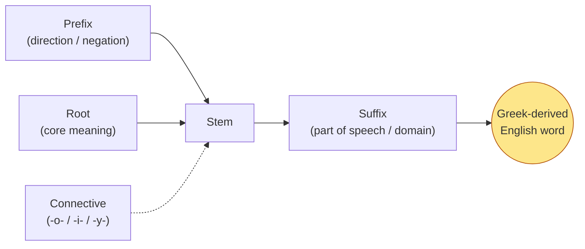
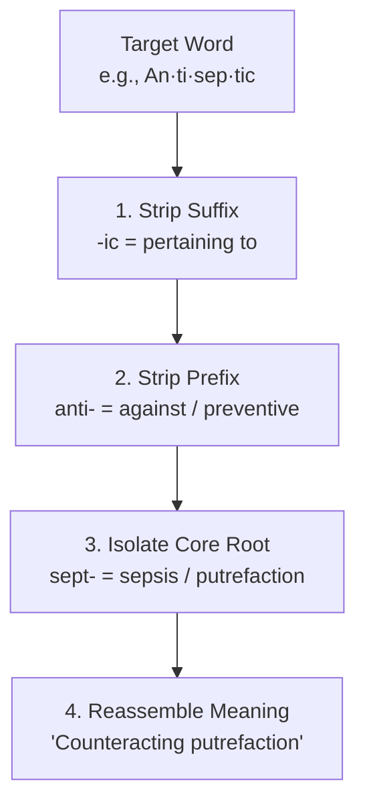

# Greek Word Construction & Deconstruction

> The master morphology toolkit for every English word of Greek origin. Every Greek-derived English word is built from a modular, Lego-like architecture — master the components to decode any complex term.

## The Construction Equation

> **[ Prefix ] + [ Connective Vowel (-o-) ] + [ Root ] + [ Suffix ]**  
> The connective vowel **-o-** is the primary phonetic bridge gluing Greek morphemes together (e.g. *bio* + *o* + *logy* = *biology*).

---

## 🧩 Module 1 — Greek Prefixes (The Front End)

| Prefix | Greek Form | Core Meaning | Key Examples |
|---|---|---|---|
| **a- / an-** | ἀ- / ἀν- | not, without (alpha privative) | [[atheist]], [[anonymous]], [[apathy]], [[agnostic]] |
| **ana-** | ἀνά | up, back, again, throughout | [[analysis]], [[anatomy]], [[anachronism]], [[anabasis]] |
| **anti- / ant-** | ἀντί | against, opposite, preventive | [[antibiotic]], [[antidote]], [[antagonist]], [[antipathy]] |
| **apo- / ap-** | ἀπό | away from, off, detached | [[apogee]], [[apostle]], [[apology]], [[apocalypse]] |
| **cata- / cat-** | κατά | down, completely, against | [[catastrophe]], [[catalog]], [[catalyst]], [[catacomb]] |
| **dia-** | διά | through, across, between | [[dialogue]], [[diameter]], [[diagnosis]], [[dialectic]] |
| **dys-** | δυσ- | bad, difficult, impaired | [[dyslexia]], **dysfunction**, [[dystopia]], **dyspnea** |
| **ec- / ex-** | ἐκ / ἐξ | out of, from, outside | [[eccentric]], **eclipse**, [[exodus]], [[ecstasy]] |
| **en- / em-** | ἐν / ἐμ- | in, within, inside | [[energy]], [[empathy]], [[endemic]], [[emphasis]] |
| **endo-** | ἔνδον | internal, inside, within | [[endocrine]], [[endoskeleton]], [[endogenous]] |
| **epi- / ep-** | ἐπί | upon, over, in addition | [[epidermis]], [[epitaph]], [[epidemic]], [[epilogue]] |
| **exo- / ecto-** | ἔξω / ἐκτός | outside, external, outer | [[exoskeleton]], [[exotic]], [[ectoderm]] |
| **eu-** | εὖ | good, well, normal | [[euphoria]], [[euphemism]], [[eulogy]], [[euthanasia]] |
| **hyper-** | ὑπέρ | over, above, excessive | [[hyperbole]], **hypertension**, **hyperactive** |
| **hypo-** | ὑπό | under, below, deficient | [[hypothesis]], [[hypodermic]], [[hypothermia]] |
| **meta- / met-** | μετά | change, beyond, after, between | [[metaphor]], [[metamorphosis]], [[metaphysics]] |
| **para- / par-** | παρά | beside, beyond, abnormal, auxiliary | [[paradox]], [[parallel]], [[parasite]], **paramedic** |
| **peri-** | περί | around, enclosing, surrounding | [[perimeter]], [[periphery]], [[periscope]], [[period]] |
| **pro-** | πρό | before, forward, in front | [[prologue]], [[prophet]], [[prognosis]], [[program]] |
| **syn- / sym- / syl- / sys-** | σύν | with, together, integrated | [[symphony]], [[synonym]], [[synthesis]], [[system]] |

---

## 🧱 Module 2 — Greek Suffixes (The Back End)

### A. Academic & Scientific Disciplines
| Suffix      | Greek Form | Meaning                             | Key Examples                                                   |
| ----------- | ---------- | ----------------------------------- | -------------------------------------------------------------- |
| **-logy**   | -λογία     | study, science, doctrine of         | [[biology]], [[psychology]], [[geology]], [[theology]]         |
| **-graphy** | -γραφία    | writing, recording, descriptive art | [[geography]], [[biography]], [[photography]], [[calligraphy]] |
| **-nomy**   | -νομία     | law, custom, system of arrangement  | [[astronomy]], [[economy]], [[taxonomy]], [[autonomy]]         |
| **-metry**  | -μετρία    | art or science of measuring         | [[geometry]], [[symmetry]], [[trigonometry]], [[optometry]]    |
| **-ics**    | -ικά       | systematic body of knowledge / art  | [[physics]], [[ethics]], [[politics]], [[economics]]           |

### B. Medical & Pathological Classifications
| Suffix      | Greek Form | Clinical Meaning                     | Key Examples                                                 |
| ----------- | ---------- | ------------------------------------ | ------------------------------------------------------------ |
| **-itis**   | -ῖτις      | acute or chronic inflammation        | [[arthritis]], [[bronchitis]], [[dermatitis]], [[hepatitis]] |
| **-osis**   | -ωσις      | abnormal condition, diseased state   | [[neurosis]], [[thrombosis]], [[diagnosis]], [[psychosis]]   |
| **-oma**    | -ωμα       | tumor, swelling, morbid growth       | [[carcinoma]], [[melanoma]], [[adenoma]], [[sarcoma]]        |
| **-pathy**  | -πάθεια    | disease, suffering, feeling          | [[neuropathy]], [[pathology]], [[empathy]], [[sympathy]]     |
| **-algia**  | -αλγία     | localized physical pain              | [[neuralgia]], [[arthralgia]], [[myalgia]], [[cardialgia]]   |
| **-ectomy** | -εκτομία   | surgical excision or removal         | [[appendectomy]], [[mastectomy]], [[tonsillectomy]]          |
| **-tomy**   | -τομία     | surgical incision or cutting         | [[anatomy]], [[lobotomy]], [[tracheotomy]], [[craniotomy]]   |
| **-plasty** | -πλαστική  | surgical repair or plastic reshaping | [[rhinoplasty]], [[arthroplasty]], [[angioplasty]]           |
| **-scopy**  | -σκοπία    | visual examination via instrument    | **microscopy**, [[endoscopy]], [[arthroscopy]]               |

---

## 🔬 Module 3 — The 4-Step Deconstruction Workflow

---

## 🔗 Navigation
- Master Map of Content → [[Dashboard — Greek Roots]]
- Construction Atlas → [[Greek Construction & Deconstruction Atlas]]
- Root Shifts → [[Advanced Greek Root Rules (Internal Shifts & Transliteration)]]
