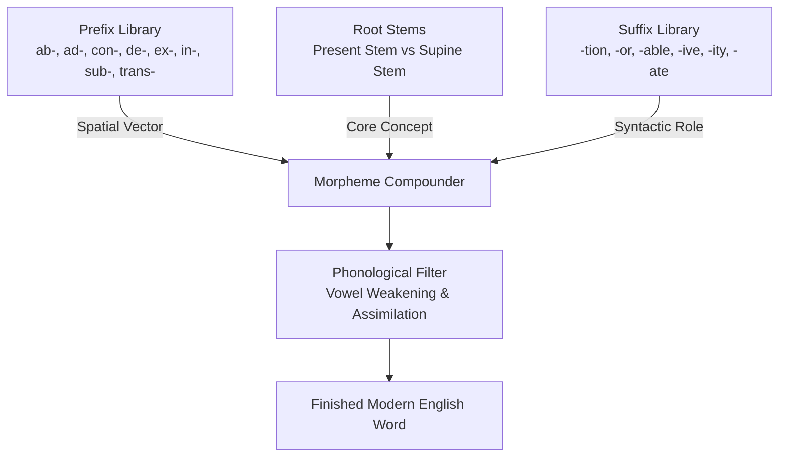

# Latin Word Construction and Deconstruction Guide

> [!abstract] 🏛️ The Master Architectural Blueprint
> This guide unifies the principles of Latin morphology, prefix vectors, stem alternation, and suffix mechanics into a single operational framework.

---

## 1. Morphological Assembly Flowchart

---

## 2. Compounding Dynamics

Latin vocabulary enters English through three primary evolutionary channels:
1. **Direct Borrowing from Classical Latin:** Preserves pure Latin stems (*agenda, status, affidavit, exit, circus, doctor*).
2. **Post-Classical & Legal Anglo-French Transmission:** Underwent vowel changes in Old French before entering Middle English (*capere* -> *receive, deceive, deceit*; *faciō* -> *feasible, defeat, forfeit*).
3. **Scientific & Renaissance Neologisms:** Systematically constructed using Classical Latin morphemes for modern medicine, taxonomy, and physics (*cardiovascular, locomotion, radioactive, spacecraft*).

---

## 3. Disciplinary Registers Breakdown

Latin roots form the backbone of formal English across major domains:
- 🏛️ **Law & Civics:** *jurisprudence, affidavit, injunction, subpoena, testament, legislate, culpable*.
- 🔬 **Medicine & Physiology:** *ventricle, coagulation, ossification, respiration, muscular, incision*.
- 🎓 **Academic & Critical Thought:** *hypothesis, deduce, synthesize, elucidate, interpolate, postulate*.
- 💼 **Business & Governance:** *corporation, transaction, fiduciary, liquidate, executive, administrative*.
