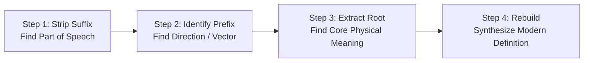

# The 4-Step Dissection Method

> [!abstract] 🔬 Systematic Word Deconstruction
> When encountering an unfamiliar Latinate English word, follow this 4-step algorithm to peel back its morphological layers and decode its exact meaning.

---

---

## The 4 Steps in Detail

### Step 1: Strip Suffix (Determine Part of Speech & Job)
- Look at the ending (*-tion, -ible, -ate, -ous, -ity, -ment*).
- **Ask:** Is this a noun (thing/act), adjective (description/capability), or verb (action)?

### Step 2: Identify Prefix (Determine Direction or Stance)
- Look at the beginning (*con-, de-, ex-, in-, sub-, trans-, re-*).
- Watch for **assimilation** (e.g. *ad-* becoming *ac-*, *con-* becoming *col-*).
- **Ask:** Is the motion moving forward (*pro-*), backward (*re-*), together (*con-*), out (*ex-*), or under (*sub-*)?

### Step 3: Extract Root & Reverse Sound Shifts (Find the Anchor)
- Look at the core stem remaining in the middle.
- Check for **vowel weakening** (e.g. *-fic-* -> *facere*, *-cip-* -> *capere*, *-cid-* -> *cadere* or *caedere*).
- **Ask:** What is the physical, sensory, or Roman civic action at the center?

### Step 4: Rebuild Meaning (Synthesize Literal to Abstract)
- Combine: $\text{Prefix} + \text{Root} + \text{Suffix}$.
- Trace the leap from the ancient physical action to modern formal English.

---

## 🔬 Worked Diagnostic Examples

### Example 1: `incontestable`
1. **Suffix:** `-able` -> Adjective (*capable of being*)
2. **Prefixes:** `in-` (*not*) + `con-` (*together*)
3. **Root:** `test` (*testis* = witness, attest)
4. **Rebuild:** *not + together + witness/attest + able* -> "Not capable of being challenged or contested" -> **Incontestable**.

### Example 2: `circumnavigation`
1. **Suffix:** `-ation` -> Noun (*the act or process of*)
2. **Prefix:** `circum-` (*around*)
3. **Root:** `nav` (*navis* = ship) + `ig` (weakened from *agere* = to drive)
4. **Rebuild:** *around + ship-driving + act of* -> "The act of sailing all the way around the world" -> **Circumnavigation**.

### Example 3: `benevolent`
1. **Suffix:** `-ent` -> Adjective (*characterized by*)
2. **Prefix/Modifier:** `bene` (*well, good*)
3. **Root:** `vol` (*velle, volo* = to wish, will)
4. **Rebuild:** *good + wishing + having trait of* -> "Wishing good upon others; charitable and kind" -> **Benevolent**.
